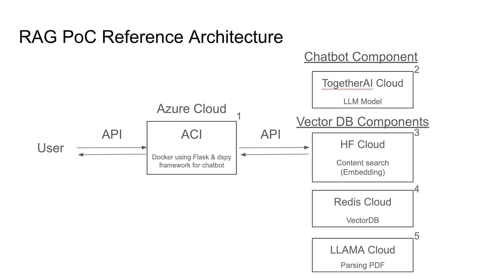
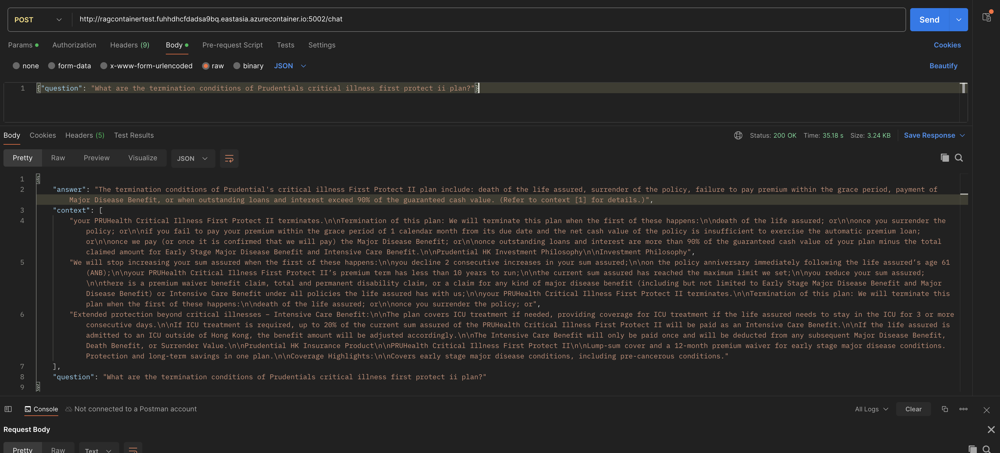
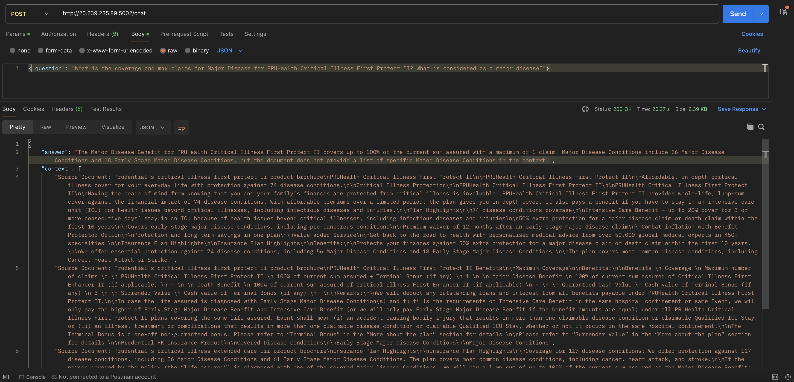
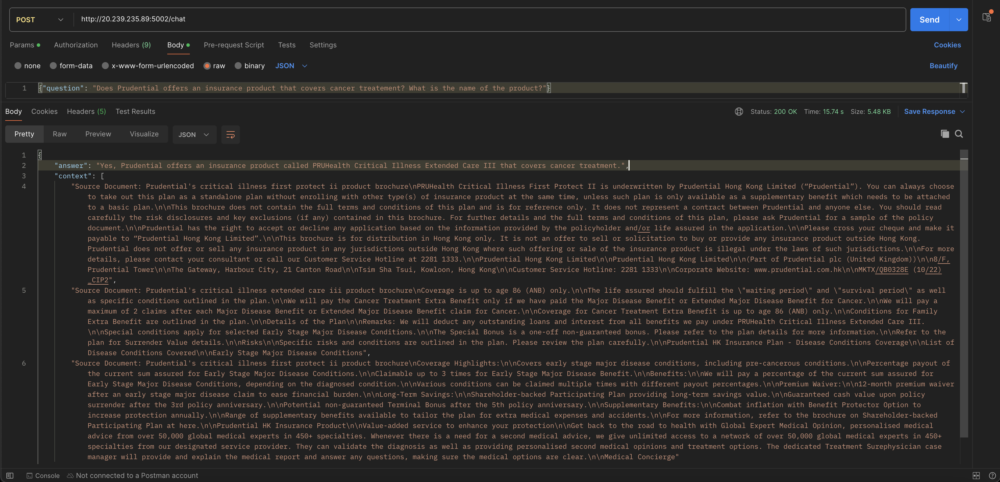
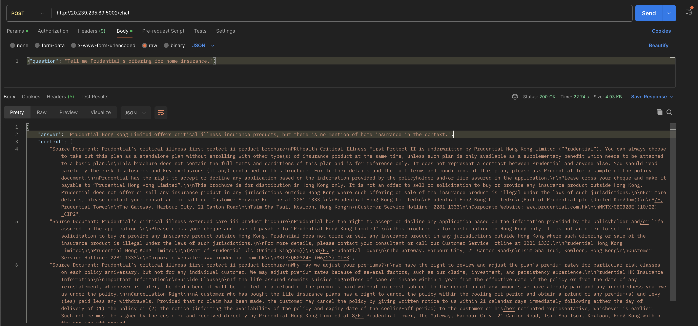

# RAG based Q&A chatbot demo with LLMs
## Objective
This repository serves as a mini PoC to demonstrate the capabilities of applying Gen AI on Q&A based chatbots. 

In this PoC, 2 of Prudential's product pdfs are served as knowledge base  (pruhealth-critical-illness-extended-care-iii & pruhealth-critical-illness-first-protect-ii) for the chatbot and the chatbot will reply to user's questions based on its knowledge base only.

## Architecture of the PoC

The architecture of this PoC consists of 5 key components: Azure, Redis, HuggingFace cloud, Together AI cloud and LLAMA cloud. It is intentional to leverage cloud environment to build the key components so that the solution can scale up/down easily when it comes to deployment:

### Key components
1. **ACI** (Azure Container instance): Deployed a docker for the RAG solution using dspy prompt framework and API service using flask
2. **LLM Model**: Deployed `MISTRALAI/MISTRAL-7B-INSTRUCT-V0.2` on TogetherAI cloud to generate the answer given content and question
3. **Content (Vector) search**: Leverages HuggingFace serverles cloud `WhereIsAI/UAE-Large-V1` model to get vector given a text for content (vector search)
4. **Vector DB**: Deployed vector DB using `Redis Stack` to store and search KNN vectors
5. **PDF content parsing**: Leverages `LLAMAPARSE` on LLAMA coud to parse unstructured PDF into MD files to build the vector (content) DB.

### Tech discussion
1. Architecture: All components of the solution leverages cloud technology. The solution can be scaled up/down easily according to the needs of the business case.
2. Prompts: The prompts are handled by the `DSPY` framework. A simple `CoT (Chain of Thought)` and `Signature` components are used in this PoC. The prompt is designed to ask the LLM model to generate short, fact based answers based on the content provided by the content search components in `OutputField` component in the on top of the `Signature` class.
3. LLM params: The LLM text generation params are kept as default to encourage the model predict short, precise, fact based answers (e.g. temperature is set to 0, repetition_penalty = 1 etc.)
4. Document splitting: `LLAMAPARSE` is used for parsing PDF files to MD files. It is proved to be one of the best pdf parsing tool pubically available. However, it loses some information when convert back to text which can be further improved.

## Use the chatbot
The code has been deployed on Azure using ACI (container). You can call the API directly to test the chatbot referring to the below section.

Some sample outputs of the chatbot is ready on the Appendix section.

### Calling the API
API address: http://ragdockerdemopublic.eze0fyfwcca4dud4.eastasia.azurecontainer.io:5002/

Note for performance: **Minimal resources** is used to deploy the solution and it has external dependencies in this PoC(including serverless LLM models on public cloud), the API may ran into some issues when calling the external dependencies. 

It may take up to 30s to return the results. It may even run into an internal error due to the popularity of the serverless SoTA LLM APIs, please try to call again if you encounter such issue.

### API specification
The API requires only 1 key (param) provided in json format:
1. question (str): The question you wish to ask the chatbot

The API returns 3 keys in json format:
1. question (str): Returns the questions directly
2. context (str): Returns the PDF sections that the chatbot used to generate the answer
3. answer (str): Returns the answer of the question with the context provided

## How to deploy the code locally or on cloud
### Configuration and API consumption
In order for successful deployment, you will need to update the API URL & credentials in your environment variables (Details of the architecture will be discussed in the later sections):
1. `TOGETHER_API_URL`: For LLM, you may get their API key on their website
2. `TOGETHER_API_KEY`: For LLM, you may get their API key on their website
3. `HUGGINGFACE_API_KEY`: For calling the embedding model
4. `LLAMAPARSE_API_KEY`: For PDF parsing, only if you wish to update the knowledge base
5. `REDIS_ACCT`: For storing/caching the vectors used as knowledge base
6. `REDIS_PW`: For storing/caching the vectors used as knowledge base

### Deployment
There are two ways to deploy the codes, both offers to deploy an API either with directly with venv or docker. 
1. Deploy directly with venv: You may create a virtual environment and install all the required packages using `requirements.txt` and then run `app.py` to use flask to deploy API for API call. 
2. Deploy with container: The code is already packaged into a docker image. You may use the docker repo `plato1994/ragchatbotdemodocker` and deploy it locally/ on cloud.

### Optional
1. You may wish to add some more documents into the vector database. You can add new pdf documents under `docs` folder then run `build_vectorbase.py` to add new documents into the vector DB.
2. You may wish to use other components (LLM models/embeddings etc.). You can change the LLM model or change the parameters used in this deployment. You may find all the configuration settings under `config` folder. E.g. You may use another LLM for the chatbot by changing `TOGETHER_MODEL_ID` under `config/llm.py`

## Next steps and improvements
1. Adjust the LLM params & instruction prompt for better response (e.g. provided the answer with the right amount of details)
2. Improve parsing especially for unstructired table contents and inforation that is scattered in the PDF
3. Test implementing ReAct/assertions/ suggestions
4. Prepare small data from business user for few shot learning
5. Build Responsible AI framework on top of the solution
6. Fine tune the llm model/embedding layer if needed

## Appendix
### Sample API results
1. Ansering product specific question. It can provide the details of the product mentioned in PDF in text format.

2. Answering product specific question. The answer of this question are scattering in different pages from the document in different document (text and table format). The chatbot can answer the coverage, max claim  count but failed to list the complete major disease list which is reasonable as this PoC only returns top 3 chunk of text in content searching phase and is not capable to handle complex tasks.

3. Answering product offerings for certain coverage. It can name the insurance product that provide required coverage.

4. Answering product questions that does not exist in the knowledge base provided. It will indicate that such info is not in the knowledge base provided.

